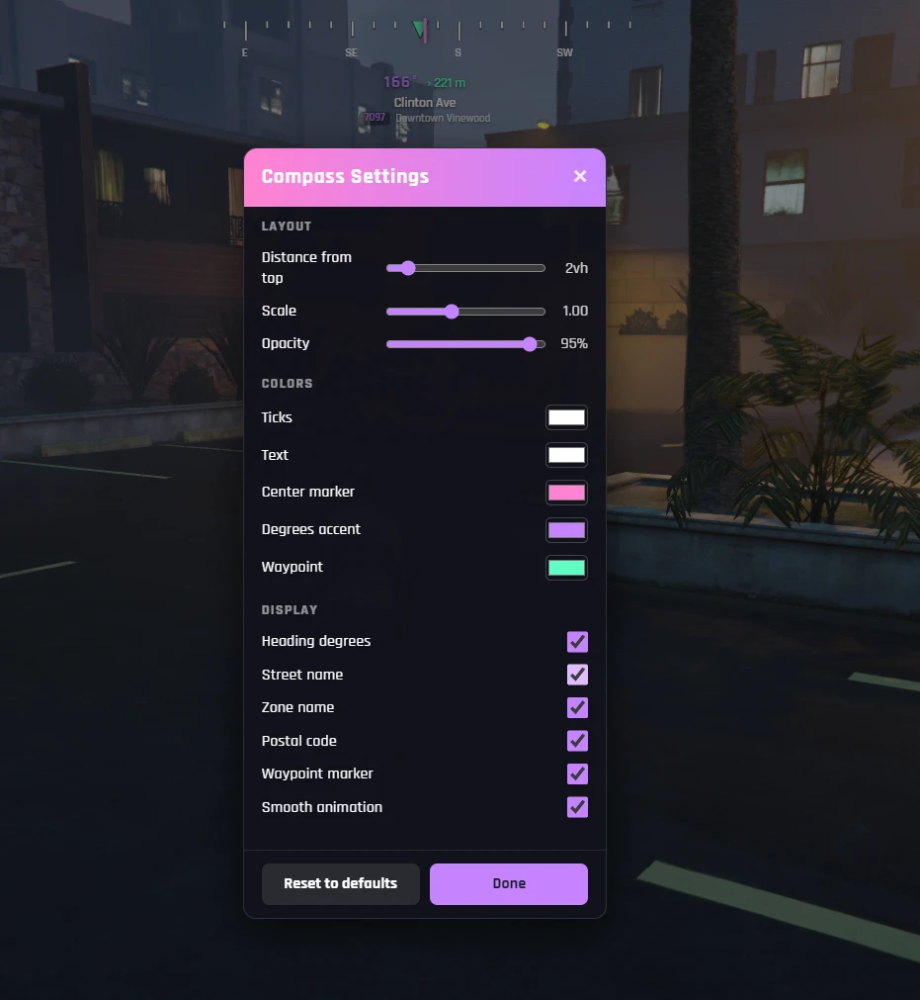

<div align="center">

# virtue-compass

**A lightweight, fully configurable compass HUD for FiveM.**

Heading • street / zone / postal • waypoint bearing & distance • in-game settings • zero dependencies

<br>



</div>

---

## Features

- 🧭 **Smooth compass strip** (N / NE / E …) driven by your camera heading, animated client-side
- 🔢 **Heading degrees** readout (e.g. `045°`)
- 🎯 **Waypoint tracking** — a marker on the strip points to your GPS waypoint, with live distance; pins to the edge when the target is behind you
- 🗺️ **Location** — current street + crossing street, zone / area name, and nearest **postal** (ships with 1,600+ codes)
- 🙈 **Smart auto-hide** — fades out in the pause menu, while dead, or during screen fades
- ⚙️ **In-game settings menu** — move, scale, recolor and toggle every element live; saved per-player
- 🔌 **Exports + events API** so other resources can show / hide / toggle it
- 🧩 **Framework-agnostic** — auto-detects QBox / QBCore / ESX, otherwise runs standalone
- 🪶 **Zero dependencies** — pure game natives + vanilla JS. No ox_lib, no UI framework, no build step
- ⚡ **~0.00ms idle** — adaptive loops do nothing while you're parked and not turning

> Each player's on/off choice **and** personal display settings persist between sessions.

## Installation

1. Drop the `virtue-compass` folder into your `resources` directory.
2. Add to your `server.cfg`:
   ```cfg
   ensure virtue-compass
   ```
3. Start the server (or `ensure virtue-compass` from the console).

No database and no other resources are required.

## Commands

| Command | Description |
|---------|-------------|
| `/compass` | Toggle the compass on / off |
| `/compassmenu` | Open the settings menu (Esc or **Done** to close) |

A key bind can be set in **Settings → Key Bindings → FiveM**, or given a default with `Config.Keybind`.

## Configuration

Defaults live in [`config.lua`](config.lua). Players can override the display options live from the
in-game menu — their choices are saved individually.

| Option | Default | Description |
|--------|---------|-------------|
| `DefaultEnabled` | `true` | Compass on for first-time players |
| `Command` | `'compass'` | Toggle command (`false` to disable) |
| `MenuCommand` | `'compassmenu'` | Settings menu command (`false` to disable) |
| `Keybind` | `''` | Optional default key (e.g. `'F7'`) |
| `ShowDegrees` | `true` | Numeric heading readout |
| `ShowStreet` / `ShowZone` / `ShowPostal` | `true` | Street, zone & postal readouts |
| `ShowWaypoint` | `true` | Waypoint marker + distance |
| `DistanceUnit` | `'metric'` | `'metric'` (m / km) or `'imperial'` (ft / mi) |
| `SmoothNeedle` | `true` | Animate between headings |
| `HideOnPauseMenu` / `HideWhenDead` / `HideOnFade` | `true` | Smart auto-hide rules |
| `HeadingInterval` / `InfoInterval` / `IdleInterval` | `30` / `400` / `500` | Sample rates (ms) — see comments in config |
| `UI.*` | — | Position, scale, colors, opacity (per-player overridable) |

## Settings menu

`/compassmenu` opens a panel to adjust, with **live preview**:

- **Layout** — distance from top, overall scale, opacity
- **Colors** — ticks, text, center marker, degrees accent, waypoint
- **Display** — toggle degrees, street, zone, postal, waypoint, smooth animation

Changes save instantly per-player; **Reset to defaults** restores `config.lua` values.

## Postal codes

The nearest-postal readout uses [`data/postals.json`](data/postals.json) — an array of
`{ "code", "x", "y" }` entries. A full map (1,600+ codes) ships out of the box. To use your own
set, replace the file keeping the same shape. Disable with `Config.ShowPostal = false`.

## Developer API

Control the compass from another resource without touching the player's saved choice:

```lua
-- exports
exports['virtue-compass']:SetVisible(false)  -- temporary hide (cutscene, no-HUD zone)
exports['virtue-compass']:SetVisible(true)   -- show again
exports['virtue-compass']:Enable()           -- turn on  (persists)
exports['virtue-compass']:Disable()          -- turn off (persists)
exports['virtue-compass']:Toggle()
local isOn = exports['virtue-compass']:IsEnabled()

-- events (also work from the server via TriggerClientEvent)
TriggerEvent('virtue-compass:setVisible', false)
TriggerEvent('virtue-compass:toggle')
```

## Performance

Built to stay out of your server's resmon:

- Both loops are **adaptive** — they fall back to an idle poll rate when the view is static and you
  aren't moving, so the resource sits at ~0.00ms while parked.
- Heading, location and waypoint data are only sent to the UI **when they actually change**.
- Animation is handled entirely client-side (requestAnimationFrame), so the Lua side stays light.
- When toggled off, the render threads exit completely — no idle work at all.

## License

Released under the [MIT License](LICENSE) © Virtue.
